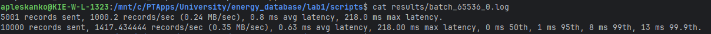
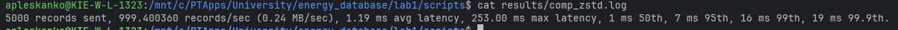
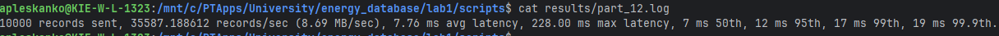
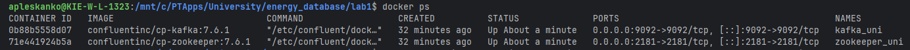
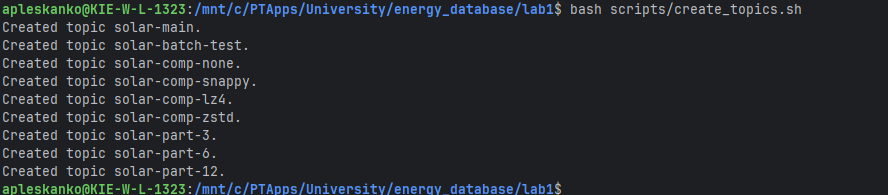
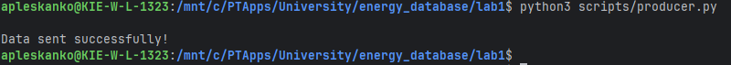
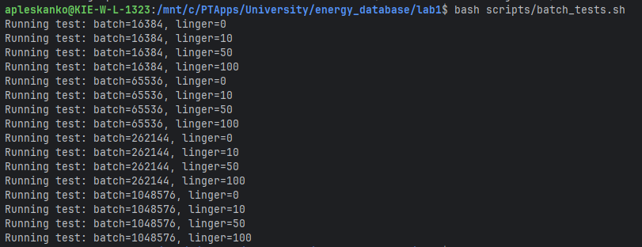
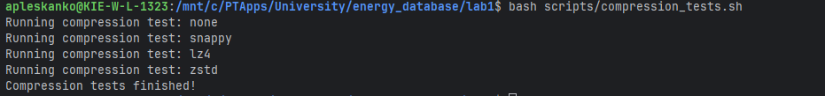

<div align="center">

НАЦІОНАЛЬНИЙ ТЕХНІЧНИЙ УНІВЕРСИТЕТ УКРАЇНИ "КИЇВСЬКИЙ ПОЛІТЕХНІЧНИЙ ІНСТИТУТ ІМЕНІ ІГОРЯ СІКОРСЬКОГО”  
НАВЧАЛЬНО-НАУКОВИХ ІНСТИТУТ АТОМНОЇ ТА ТЕПЛОВОЇ ЕНЕРГЕТИКИ  
КАФЕДРА ЦИФРОВИХ ТЕХНОЛОГІЙ В ЕНЕРГЕТИЦІ

</div>


<div align="right">
Виконав: студент групи ТР-52мп Плесканко А.В.

Перевірив: Волков О.В.
</div>

<div align="center">
Київ – 2025
</div>

# Лабораторна робота №1

**Дослідження продуктивності Apache Kafka для енергетичних IoT-потоків**  
Варіант: №11(1) - Сонячні електростанції Київської області  
Підваріант: B (Analytics focus)

## Мета роботи

Дослідити продуктивність Apache Kafka для системи моніторингу сонячних електростанцій, оптимізуючи throughput,
ефективність стиснення та інтеграцію з DWH.

## Зміст роботи

1. **Запуск Apache Kafka**  
   Для запуску сервісів Kafka та Zookeeper використовується Docker Compose.  
   Виконайте команду у каталозі `lab1`:
   ```
   docker-compose up -d
   ```
   Це автоматично розгорне необхідні компоненти для тестування.

2. **Створення топіків і інших завдань**
   Далі, для відтворення результатів, потрібно виконати скрипти які зберігаються у папці scripts створюються за
   допомогою скриптів із папки `scripts`.

3. **Реалізація продюсера та консьюмера**  
   Для надсилання та прийому повідомлень використовуйте скрипти з папки `scripts`:
    - Продюсер:
      ```
      python scripts/producer.py
      ```
    - Консьюмер:  
      (Додайте команду запуску, якщо є відповідний скрипт)

4. **Демонстрація обміну даними**  
   Для демонстрації обміну даними та проведення тестів використовуйте скрипти з папки `scripts` відповідно до
   завдання.  
   Запускайте їх у потрібному порядку для виконання batch, compression та partition тестів.

## Основні результати

### Batch.size та linger.ms

| Конфігурація | Records/sec | Avg Latency (ms) | Використання |
|--------------|-------------|------------------|--------------|
| 16KB, 0ms    | 999.5       | 0.71             | Real-time    |
| 64KB, 0ms    | 1417.4      | 1.48             | Analytics    |
| 256KB, 50ms  | 1276.7      | 84.57            | Batch        |
| 1MB, 0ms     | ~1000       | 0.60             | Min latency  |



- **Найнижча затримка:** batch.size=1MB, linger.ms=0 (0.60 мс)
- **Максимальна пропускна здатність:** batch.size=64KB, linger.ms=0 (1417.4 записів/сек)
- **Рекомендація:** linger.ms=0 для мінімальної затримки; оптимальний batch.size для throughput — 64KB

### Алгоритми стиснення

| Алгоритм | Records/sec | Latency (ms) | Compression Ratio | Рекомендація     |
|----------|-------------|--------------|-------------------|------------------|
| none     | 998.6       | 3.34         | 0%                | Real-time        |
| snappy   | 999.0       | 8.89         | ~39%              | Застарілий       |
| lz4      | 999.2       | 2.96         | ~44%              | Швидке стиснення |
| zstd     | 999.4       | 1.98         | ~52%              | Архівування      |



- **Найкраще стиснення та продуктивність:** zstd (52%, 1.98 мс)
- **Рекомендація:** compression=zstd для аналітики та архівування

### Масштабованість партиціонування

| Партиції | Records/sec | Scaling Factor |
|----------|-------------|----------------|
| 3        | 29,411      | 1.0x           |
| 6        | 32,679      | 1.11x          |
| 12       | 35,587      | 1.21x          |




- **Оптимально:** 12 партицій для збору історичних даних

## Рекомендації

- **Real-time моніторинг cloud_factor:**  
  batch.size=1MB, linger.ms=0, compression=none, partitions=6  
  _Латентність <1ms, Throughput ~1000 rec/sec_

- **Batch обробка irradiance:**  
  batch.size=64KB, linger.ms=0, compression=zstd, partitions=12  
  _Throughput >35,000 rec/sec, Compression ~52%_

- **Архівування power_output:**  
  batch.size=256KB, linger.ms=100, compression=zstd, partitions=12  
  _Storage optimization: >2x reduction_

- **Стратегія:** Використовувати 12 партицій та zstd для аналітичних топіків, налаштовуючи batch.size та linger.ms під
  вимоги.

## Висновки

- linger.ms=0 — мінімальна затримка
- batch.size=64KB — найкращий throughput
- zstd — найефективніше стиснення та швидкість
- 12 партицій — максимальна пропускна здатність

**Оптимальна конфігурація для аналітичної системи:**  
`batch.size=64KB, linger.ms=0, compression=zstd, partitions=12`  
_Throughput ~35,000 rec/sec, Latency ~12ms_

## Додатки: Протокол виконання







