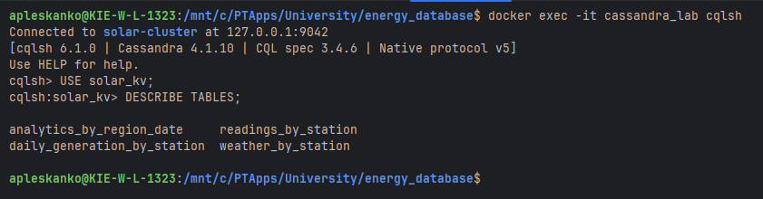
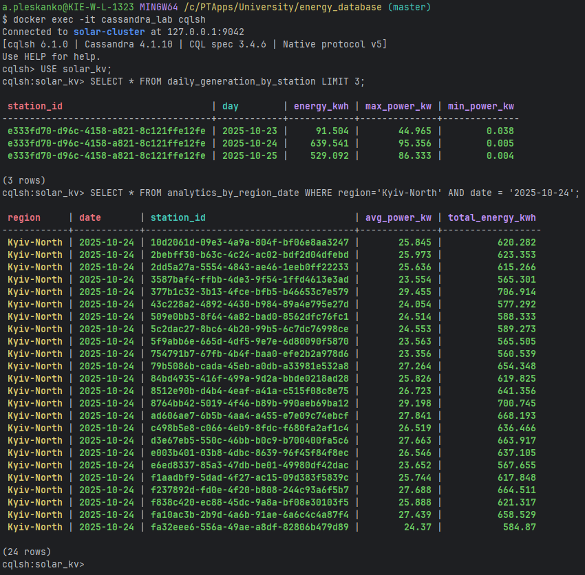
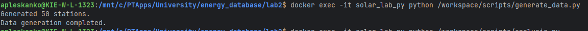
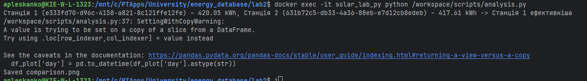
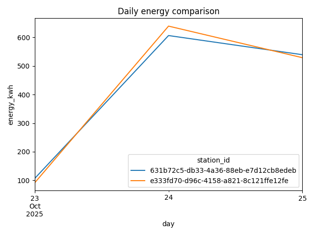

НАЦІОНАЛЬНИЙ ТЕХНІЧНИЙ УНІВЕРСИТЕТ УКРАЇНИ "КИЇВСЬКИЙ ПОЛІТЕХНІЧНИЙ ІНСТИТУТ ІМЕНІ ІГОРЯ СІКОРСЬКОГО”  
НАВЧАЛЬНО-НАУКОВИХ ІНСТИТУТ АТОМНОЇ ТА ТЕПЛОВОЇ ЕНЕРГЕТИКИ  
КАФЕДРА ЦИФРОВИХ ТЕХНОЛОГІЙ В ЕНЕРГЕТИЦІ

Виконав: студент групи ТР-52мп Плесканко А.В.

Перевірив: Волков О.В.

Київ – 2025

# Лабораторна робота №2

**Основи Cassandra: створення першої енергетичної системи моніторингу**  
Варіант: №11(1) - Сонячні електростанції Київської області
Підваріант: Б

## Мета роботи

Освоїти принципи проєктування розподілених схем даних у Apache Cassandra
на прикладі енергетичних систем моніторингу. Навчитися створювати
keyspace, таблиці з різними типами ключів, наповнювати їх тестовими
даними, виконувати базові запити та аналізувати ефективність різних схем
зберігання.

## Завдання за варіантом

Виконати моделювання моніторингу сонячних електростанцій Київської області (варіант №11(1), підваріант Б):
- Розробити схему keyspace та таблиць для зберігання даних вимірювань, погодних умов, добових підсумків та аналітики.
- Реалізувати генерацію та завантаження тестових даних у Cassandra.
- Виконати базові запити для аналізу даних.

## Скриншоти виконання команд у cqlshІ

### 2️⃣ Створення keyspace і таблиць

Було створено keyspace solar_kv і таблиці analytics_by_region_date, daily_generation_by_station, readings_by_station, weather_by_station.

### Демонстрація вибірки даних за ключами

Для підтвердження ефективності обраних ключів, було виконано два запити:
1.  Вибірка історії однієї станції (ключ `station_id`).
2.  Вибірка аналітики по регіону за день (ключ `(region, date)`).

Обидва запити виконались успішно, що доводить коректність спроєктованої схеми.

## Скриншоти виконання скрипту

## Короткий аналіз отриманих результатів

- Дані успішно згенеровано та завантажено у таблиці Cassandra.
- Проведено базові запити для аналізу виробітку енергії та погодних умов.
- Побудовано графік залежності виробітку енергії від часу для вибраної станції:

## Відповіді на контрольні питання

1. **Які переваги використання розподілених БД для IoT-систем?**
   - Масштабованість, відмовостійкість, висока швидкодія при великих обсягах даних.
2. **Які типи ключів використовувалися у таблицях?**
   - Прості, складені та кластеризовані ключі.
3. **Як забезпечується ефективний запис та читання даних у Cassandra?**
   - Завдяки партиціюванню, реплікації та оптимізованій структурі SSTable.

## Висновки щодо ефективності Cassandra для енергетичних IoT-систем

Apache Cassandra показала високу ефективність для задач моніторингу енергетичних IoT-систем завдяки масштабованості, швидкому запису та гнучкості у проєктуванні схем даних. Це дозволяє ефективно зберігати та аналізувати великі обсяги часових рядів та аналітичних даних у реальному часі.
